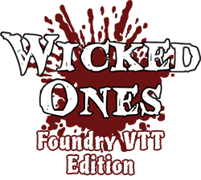
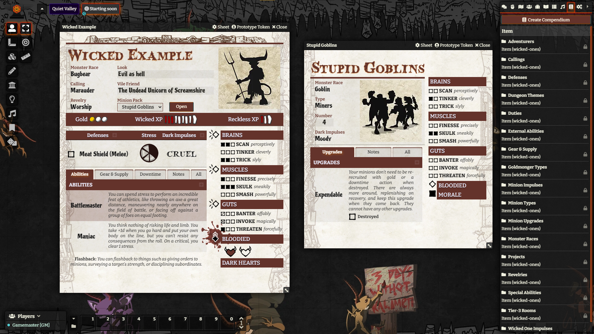
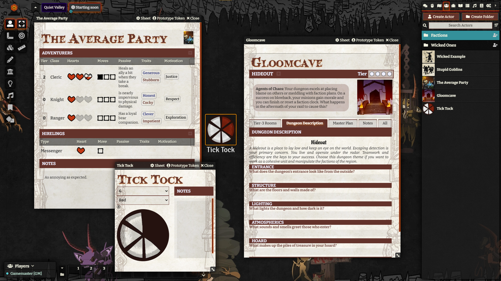
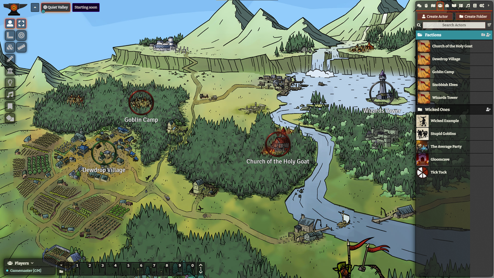
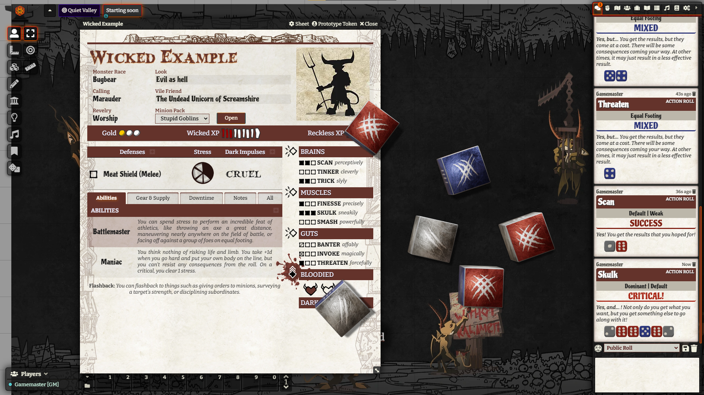
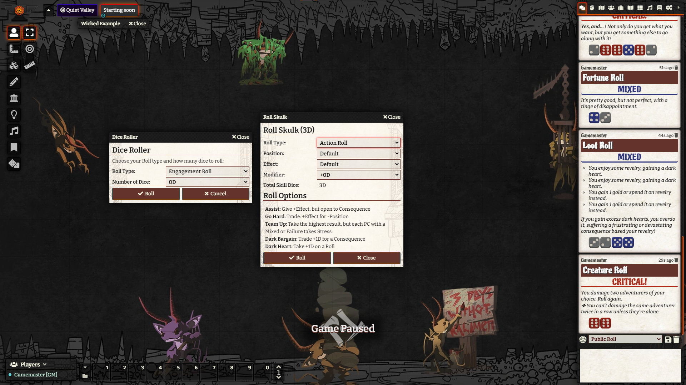
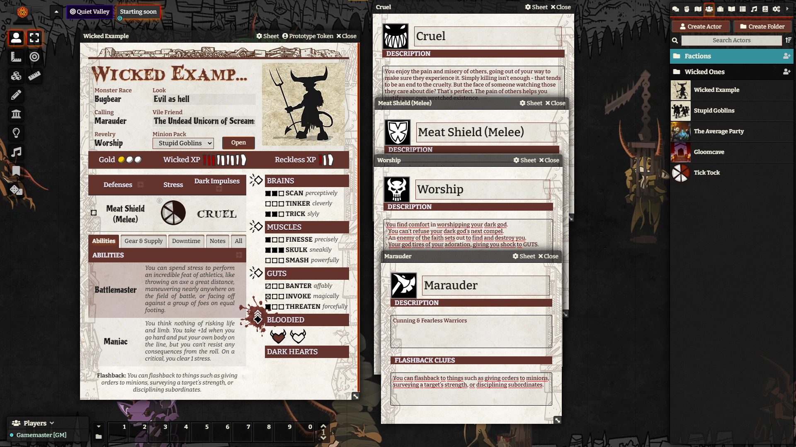

</img>

# Wicked Ones Game System for Foundry
### For questions or reporting bugs contact us on Discord: `Spearhead#4288` or `LorduFreeman#8747`.

Link to the [Wicked Ones home page](<https://banditcamp.io/wickedones/> "Wicked Ones – Bandit Camp")

Based on the great Blades in the Dark system by `megastruktur`.

#### Scroll down for pretty pictures, yeeeees.
## Install
### Using the manifest
- Copy the following url: https://github.com/eHanus/foundryvtt-wicked-ones/releases/latest/download/system.json
- Paste it into the Manifest URL field in the Install System dialog in your Foundry app.
### Using Foundry System Browser
Navigate to the Wicked Ones system and hit install!
## Usage
The module contains six "actor" types: Wicked Ones, Minion Packs, Dungeons, Factions, Adventurer Parties and finally Clocks, each with their own customized styled sheets.

Most parts of these sheets can be filled in by selecting and customizing "items". Those consist of: Adventurers, Callings, Defenses, Downtime Projects, Dungeon Duties, Rooms and Themes, Gear, Supply, Impulses, Monster Races, Revelries and more.

Most of the items and official content from the book can be found in the compendia, imported as usual and edited to entirely customize your game if you want to! No love for Strongholds? Just edit them until they fit your campaign theme. You want a new Calling with custom abilities? Easy to do, just make up new ones on the fly.

- To reset XP, Gold and other counters just click on the label name
- To add items you can click a corresponding link OR use the + Buttons. Dragging items from the associated compendium to the sheet works as well.
- Many clickable parts of the sheet display additional information on hovering over them for a while, for example Gold, XP, Stress, Skills or Shock.
- To see the description of a Calling, Dark Impulse, Ability, etc you can just click on the added item and see all the info in the popup
- When adding a new item you can hover over the "Question Mark" icon to see the item's description
- To add Custom abilities just add a new "Foundry Item" of the corresponding type and fill all the necessary info. Then drag it to the sheet or add via button on a sheet
- You can also change any information on items dragged to the sheet for customization
- Red dots on the appearing on mouse-over are used to empty bars or clocks
- Trash bins appearing on mouse-over are used to remove items like defenses or abilities from the sheet
- Enabling shock auto-applies a -1D modifier to the roll, but does not automatically clear after rolling
#### Actor Sheets
- Actions and Resistance Rolls are rolled by clicking the appropriate Action Attribute, opening a Roll Popup with further options
- Practice XP can be counted by clicking the first empty checkbox of each skill, filling it up until full.
#### Clocks
- To add a clock, go to the Actors tab and create a new actor of type "🕛 Clock". You can drag it onto the scene to create a clock token displaying progress synced with the sidebar clock (great to have progress always visible on scenes). You can edit the token as usual to change the size as well.
#### GM Rolls
- GM Rolls are done using the dice icon on the left side of the screen, last icon in the toolbar. Clicking pops up a Roll Prompt containing every type of role described in the book. Players may roll less commonly needed rolls like Creature Rolls, Trap Rolls or Loot Rolls here. 
#### Translation
The system can be translated, see the en.json file, make your own version (for example ger.json for german) and write us if you want to get your language included. Do not hesitate to ask us for help if you want to translate the game into your language!
#### Player Permissions
If you want players to have freedom to create their own items, changing their permissions to Trusted or GM Assistant or setting custom permissions is advised. Without permissions they can still add or edit all items and descriptions on their sheet but not create new ones in the sidebar. By default permissions should be sufficient to create a regular or custom character.
#### Additional Assets
Getting the official Wicked Ones assets pack is highly recommended if you want to use the Sandbox Maps (like the one shown down below) or things like monster tokens! The Asset Pack should be downloadable on either DrivethroughRPG or somewhere on Kickstarter if you backed the game.

## Screenshots of the system
(click for full size)
### Wicked One and Minion Sheet
Items or abilities are added by either clicking the description title or the **+** icon appearing on hover, deleting is done by clicking the trash bin appearing on hover. Dragging and dropping from a Compendium works as well. **Red dots** appearing on mouse-over or (0) for clocks are used to **reset skill bars or clocks**. **Practice XP** is shown by a slash or cross in the first skill square. Many elements display **tooltips** after **hovering over them** for a while.

### Adventurers, Dungeons and Clocks Sheets

### Example World Map with Faction Markers
Tiers are shown by the inner spikes of their tokens, Aligment is shown by their colour. **Drag and drop** a created faction to the scene to create this kind of token for them.

### Example Rolls and custom "Claw Marks" dice (if you use the Dice So Nice! module)
All proper rolls give you their outcome right in the chat (and you can **click the result to hide descriptions**, optional default to hidden **toggle available in the system settings!**) If you use **Dice So Nice!** you have the choice of **four custom Wicked Ones sets**: Dots (white or dark), Claw Marks or classic numbers, with dots being the default.

### Roller Pop-Ups, Multi-Roller on the left and Skill-Roller on the right
Skill-Roller pops up on **clicking skills on the sheets**, adjusts to selected options. **Multi-Roller** (dice button in the toolbar) contains all the other rolls the GM and players need for things like Engagement, Dungeon Defense and other purposes

### A few editable item windows
**Every item entry is clickable and customizable** (both in title and description)! Enter your own descriptions and customize your world.

## Mod Recommendations
- **Dice So Nice!** to use the 3D dice coming with this system
- **Pings** OR **Pointers and Pings** if you want pings like in other VTTs and dislike having always visible cursors
- **Chat Images** it's always nice to be able to post or drag inspirational images into the chat when world building
- **Drag Upload** Good for populating the map fast with tokens you do not need to fill with stats (Monster or Human Camps)
- **Select tool everywhere** + **Better Text Drawings** help with dealing with dungeon drawing

**Disclaimer**: These Recommendations are not checked for compatibility and are compatible as of now, but that might change! Many other mods may come in handy as well depending on what you want to do in your game.

## To be done
- Bugfixes
- Style improvements for the primal monsters
- Dashboard sheet for the GM for easy tracking of past invasions, pocketed blowback and other game data
- Explore the possible addition of context menus
- Ability to drag skills into the macro bar for easy access
- Quality of life improvements and limited automation
- Evaluate user input for further improvements

## To be done in the far future
- Add UA Content when it comes out (and after getting permission of course) ;)

## Troubleshooting
- If you cannot find the drag-n-dropped item, refer to the "All" tab on each sheet

## Credits
- This work is based on Wicked Ones by Ben Nielson and Victor Costa, a huge **Thank You!** to both of them for letting us use the wonderful official written and graphical content from the book to fill our system with!
- Wicked Ones is based on Blades in the Dark (Forged in the Dark License) (found at http://www.bladesinthedark.com/), product of One Seven Design, developed and authored by John Harper, and licensed for our use under the Creative Commons Attribution 3.0 Unported license (http://creativecommons.org/licenses/by/3.0/).

